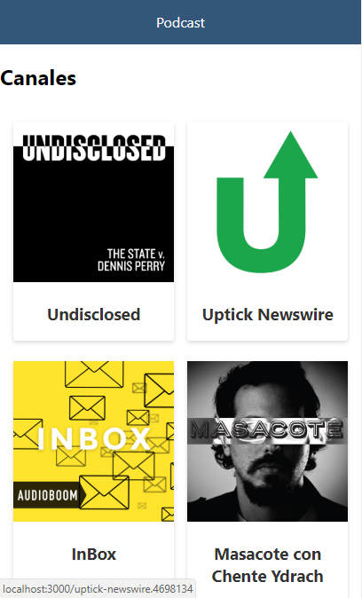
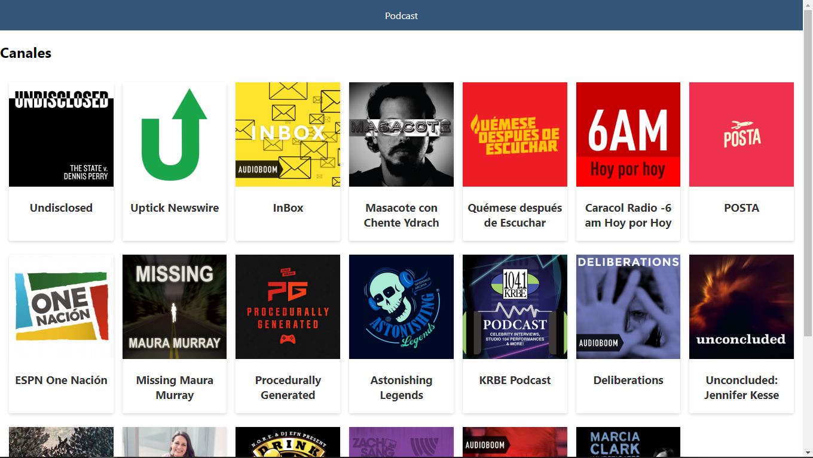

# App de podcast de platzi

App de podcast integrada con la API  de AudioBoom con Next.js
La aplicación es responsive

[Ver la aplicacion](https://podcast-xjlzgpsbnm.now.sh)

## ¿Cómo funciona?

Requiere Node.JS 10

* `npm install` para instalar las dependencias.
* `npm run dev` para el entorno de desarrollo.
* `npm install` para el entorno de producción.

## Licencia

MIT